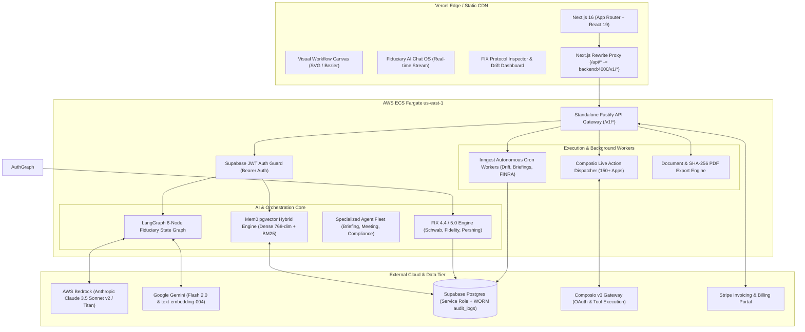

# Product Requirements Document (PRD)
## Adviza AI — Enterprise AI Operating System for Wealth Management & RIAs

---

### Document Metadata
- **Product Name**: Adviza AI
- **Version**: 3.5 (Enterprise Decoupled Production Architecture — September 2026)
- **Target Audience**: Registered Investment Advisors (RIAs), Multi-Family Offices, Wealth Management Firms, Compliance Officers (CCOs), and Wealthtech Integrators.
- **Classification**: Enterprise Technical & Product Specification
- **Last Updated**: September 2, 2026

---

## 0. Current State Status Matrix (Live vs. In-Development vs. Roadmap)

> [!NOTE]
> **Product Completeness Transparency**: The matrix below clearly delineates between fully implemented production capabilities, simulated fallback gateways, and long-term exploratory features.

| Module / Capability | Status | Implementation Details |
| :--- | :--- | :--- |
| **Standalone API Architecture** | 🟢 **Live** | Standalone Fastify backend (`adviza-backend`) decoupled from Next.js 16 UI |
| **Chat OS & Multi-Agent Orchestration** | 🟢 **Live** | LangGraph 6-node state graph (Intent → Validator → HITL → Executor → Synth → Audit) |
| **Mem0 pgvector Semantic Memory** | 🟢 **Live** | 768-dim dense embeddings + hybrid 75% vector cosine similarity + 25% BM25 keyword recall |
| **Composio Live Tool Execution** | 🟢 **Live** | Real-time execution gateway for Gmail, Google Calendar, Slack, Salesforce FSC, and Google Sheets |
| **Custodian & FIX 4.4/5.0 Engine** | 🟢 **Live** | FIX 4.4 tag-value generator & execution simulator (`SCHW_FIX`, `FID_FIMS`, `PERSHING_NETX`) |
| **Inngest Autonomous Cron Workers** | 🟢 **Live** | Nightly 6:00 AM drift auditor, 7:30 AM briefing generator, and Friday 5:00 PM FINRA package |
| **FINRA 2210 & SEC 206(4)-1 Export** | 🟢 **Live** | PDF & HTML export with SHA-256 cryptographic seal & WORM compliance audit trail |
| **Visual Workflow Canvas** | 🟢 **Live** | Infinite canvas with pan/zoom, Bezier curves, marquee select, and AI prompt generation |
| **Stripe Billing & Subscriptions** | 🟢 **Live** | Checkout, portal, webhooks, and tier enforcement fully implemented |
| **Direct Custodian FIX API Gateway** | 🟡 **In-Development** | Production FIX connectivity pending firm custodial clearing agreements (Phase 5) |
| **Multi-Advisor Live Canvas Presence** | 🔴 **Exploratory** | Multi-cursor real-time collaboration scheduled for Phase 6 |

---

## 1. Executive Summary & Vision

### 1.1 Problem Statement
Modern wealth management firms and RIAs manage hundreds of high-net-worth (HNW) client relationships while navigating strict regulatory oversight (SEC Rule 206(4)-1 Marketing Rule, FINRA Rule 2210, fiduciary standard of care). Advisors spend up to **40% of their working hours** on manual, non-revenue-generating operations:

1. **Meeting Preparation**: Sifting through CRM notes, custodian portfolio reports, and email chains before client reviews.
2. **Post-Meeting Follow-up**: Transcribing meeting recordings, drafting summaries, extracting commitments, and logging tasks into CRMs (Salesforce FSC, Wealthbox).
3. **Compliance Overhead**: Ensuring every email, marketing piece, and client recommendation adheres to SEC/FINRA promotional and disclosure standards.
4. **Disjointed Tech Stacks**: Custodians, CRMs, risk engines, billing portals, and communication channels exist in silos with no automated orchestration layer.
5. **Memory Fragmentation**: AI assistants forget context between sessions, forcing advisors to re-explain client preferences, portfolio mandates, and communication norms on every interaction.

### 1.2 Product Vision
**Adviza AI** is the first fiduciary-native, multi-agent AI operating system for wealth management. Adviza AI automates complex advisory workflows from end-to-end—combining visual node-based pipeline orchestration, generative AI agents (Claude 3.5 Sonnet / Gemini), 150+ third-party connectors (via Composio), persistent long-term vector memory (Mem0 pgvector), FIX protocol custodial rebalancing, and human-in-the-loop compliance sign-off gates.

---

## 2. User Personas & Target Roles

| Persona | Role | Primary Goal | Key Pain Point |
| :--- | :--- | :--- | :--- |
| **Lead Advisor / Principal** | Managing Partner / Wealth Advisor | Maximize client-facing time and scale AUM per advisor | High administrative drag; prep and follow-ups take hours |
| **Associate Advisor / Paraplanner** | Operations & Portfolio Support | Execute rebalancing, client onboarding, and briefing notes | Repetitive manual data entry across multiple disconnected platforms |
| **Chief Compliance Officer (CCO)** | Compliance & Regulatory Officer | Maintain audit-proof recordkeeping and prevent regulatory breaches | Risk of unvetted AI outputs or non-compliant client communications |
| **Operations Director / CTO** | Wealthtech / IT Lead | Centralize integrations, monitor pipeline reliability, and manage billing | Fragile custom scripts and fragmented software licenses |

---

## 3. Two-Service System Architecture

---

## 4. Key Functional Modules

### 4.1 Fiduciary AI Chat OS (LangGraph State Graph)
1. **Intent Planner Node**: Deconstructs advisor requests into deterministic execution steps.
2. **Connector Validator Node**: Verifies required OAuth tokens (Gmail, Google Calendar, Salesforce FSC) and prompts missing apps.
3. **HITL Gate Node**: Enforces mandatory Human-in-the-Loop review for custodial trades, client email dispatches, and suitability recommendations.
4. **Tool Executor Node**: Dispatches live actions through Composio SDK and FIX gateways.
5. **Synthesizer Node**: Combines structured execution outputs into fiduciary advisory summaries.
6. **Compliance Audit Node**: Logs tamper-evident WORM audit records for every executed turn.

### 4.2 Mem0 pgvector Semantic Memory Engine
- **Dense Embedding Generation**: Generates 768-dimensional normalized dense vectors via `text-embedding-004` / Bedrock Titan with deterministic local fallback.
- **Hybrid Retrieval**: Combines **75% vector cosine similarity** with **25% BM25 keyword matching** for sub-50ms long-term context recall.
- **Category Taxonomy**: `preference`, `persona`, `fact`, `client_context`, `workflow_habit`, and `general`.

### 4.3 Custodian Integration & FIX Protocol 4.4/5.0 Simulator
- **Message Types**:
  - `MsgType=D` (New Order Single): Tag 8 (`FIX.4.4`), Tag 35 (`D`), Tag 49 (`SenderCompID`), Tag 56 (`TargetCompID`), Tag 11 (`ClOrdID`), Tag 55 (`Symbol`), Tag 54 (`Side`), Tag 38 (`OrderQty`), Tag 40 (`OrdType`), Tag 10 (`CheckSum`).
  - `MsgType=8` (Execution Report): Simulates fill confirmations with `ExecType=2` (Filled), `LastPx`, and `CumQty`.
- **Supported Routing Profiles**:
  - Charles Schwab Institutional (`SCHW_FIX_GW`)
  - Fidelity Wealth Institutional (`FID_FIMS_GW`)
  - BNY Mellon Pershing (`PERSHING_NETX_GW`)

### 4.4 Inngest Autonomous Cron Worker Engine
- **Nightly 6:00 AM EST Drift Monitor (`0 10 * * 1-5`)**: Scans client holdings, calculates asset drift against target models, and queues rebalancing proposals.
- **Morning 7:30 AM EST Briefing Agent (`30 11 * * 1-5`)**: Scans calendar meetings for today and pre-generates executive client briefing dossiers.
- **Weekly Friday 5:00 PM EST FINRA Package (`0 21 * * 5`)**: Bundles 7-day immutable audit trails with cryptographic hash verification.

### 4.5 Fiduciary Audit & FINRA 2210 SHA-256 Export Engine
- Dynamically hashes document payloads with SHA-256 to guarantee tamper-evident integrity for books & records retention (**SEC Rule 204-2**).
- Automated exports for **FINRA Rule 2210 (Communications with the Public)** and **SEC Rule 206(4)-1 (Marketing Rule)** reviews.

---

## 5. Unit Economics & Gross Margin Model

Adviza AI's pricing and unit cost model is structured around a predictable high-margin SaaS model:

| Cost Component | Monthly Volume (Growth Tier: $499/mo) | Unit Cost | Total Monthly Cost |
| :--- | :--- | :--- | :--- |
| **AWS Bedrock Claude 3.5 Sonnet** | ~1,000 executions (2.5M input tokens / 500k output tokens) | $3.00 / $15.00 per MTok | $15.00 |
| **Google Gemini Flash / Embeddings** | ~2,500 vector embeddings & extraction calls | $0.025 / MTok | $0.25 |
| **Mem0 Vector Ingestion & Storage** | ~1,000 vector memory lookups | Included / Native Supabase | $0.00 |
| **Composio Tool Execution Gateway** | ~1,000 connected actions | $0.02 / action | $20.00 |
| **AWS ECS Fargate Backend + ALB** | 0.5 vCPU / 1GB RAM container in us-east-1 | $0.04048 / vCPU-hr | $22.00 |
| **Vercel Frontend Hosting** | Pro Team seat allocated | Fixed | $20.00 |
| **Total Cost of Goods Sold (COGS)** | — | — | **$77.25 / month** |
| **Net Gross Margin per RIA Account** | **$499.00 / month** | — | **84.5% Gross Margin** |

---

## 6. Compliance, Security & Evidence Citations

> [!IMPORTANT]
> Adviza AI is engineered to survive Chief Compliance Officer (CCO) and SEC examinations through architectural proof:

1. **WORM Storage Immutability (SEC Rule 204-2 & 17a-4)**:
   - Audit records in the `audit_logs` table are append-only. No UPDATE or DELETE operations are permitted by database Row Level Security policies. Every exported package includes a deterministic SHA-256 hash chaining proof.
2. **Zero-Training Enterprise AI Policy**:
   - All LLM interactions are routed via AWS Bedrock (with signed AWS Enterprise Business Associate Agreements) and enterprise API endpoints. No advisor data, client holdings, or transcripts are ever retained for LLM training.
3. **Human-in-the-Loop (HITL) Regulatory Firewalls**:
   - Automated trade orders (FIX Protocol) and outbound client communications require explicit, logged advisor sign-offs before external gateway transmission under FINRA Rule 3110 (Supervision).

---

## 7. API Reference Summary

| Method | Endpoint | Module | Description |
| :--- | :--- | :--- | :--- |
| `POST` | `/v1/ai/chat-orchestrate` | Chat OS | LangGraph 6-node multi-agent execution |
| `GET/POST/DELETE` | `/v1/ai/chat-sessions` | Chat OS | Chat session CRUD |
| `GET/POST/DELETE` | `/v1/ai/memory` | Mem0 | Dense vector memory search and management |
| `POST` | `/v1/ai/memory/search` | Mem0 | Hybrid semantic vector memory recall |
| `GET` | `/v1/ai/memory/dossier` | Mem0 | Category-grouped advisor knowledge dossier |
| `POST` | `/v1/portfolio/reconcile` | Portfolio | Fiduciary portfolio drift reconciliation |
| `POST` | `/v1/portfolio/fix/generate` | Portfolio | Generate FIX 4.4 tag-value message batches |
| `POST` | `/v1/portfolio/fix/transmit` | Portfolio | HITL FIX order routing & simulated fills |
| `GET` | `/v1/portfolio/fix/history` | Portfolio | List past transmitted FIX order records |
| `GET/POST/DELETE` | `/v1/integrations/composio/connections` | Integrations | Manage firm OAuth app connections |
| `POST` | `/v1/integrations/composio/send-email` | Integrations | Send email via Gmail/Outlook with audit log |
| `POST` | `/v1/integrations/composio/sync-calendar` | Integrations | Sync Google/Outlook calendar appointments |
| `GET` | `/v1/integrations/composio/toolkits` | Integrations | Dynamic search over 1,400+ Composio tools |
| `POST` | `/v1/compliance/export-finra` | Compliance | Generate signed FINRA 2210 / SEC 206(4)-1 package |
| `GET` | `/v1/documents/export` | Documents | PDF / HTML export with cryptographic SHA-256 seal |
| `GET` | `/v1/health` | System | Container healthcheck endpoint |
