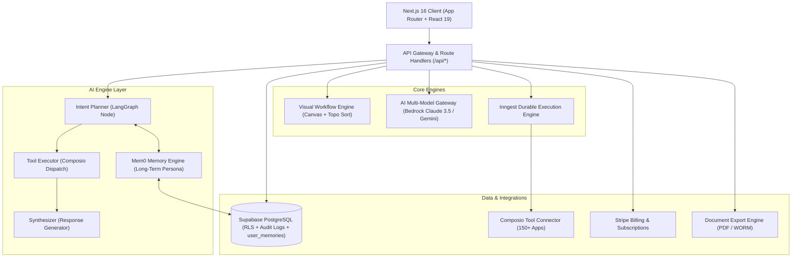
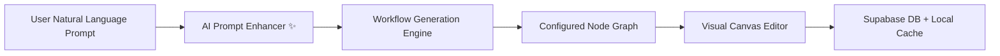
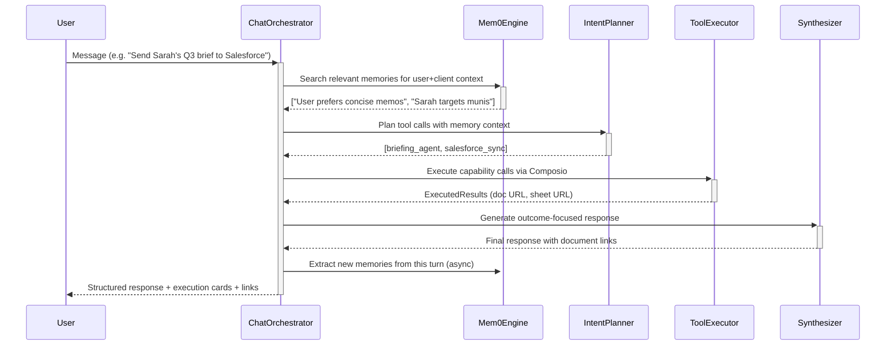
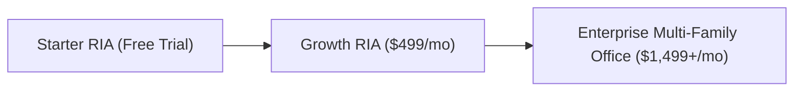

# Product Requirements Document (PRD)
## Adviza AI — Enterprise AI Operating System for Wealth Management & RIAs

---

### Document Metadata
- **Product Name**: Adviza AI
- **Version**: 3.0 (Production Release — August 2026)
- **Target Audience**: Registered Investment Advisors (RIAs), Multi-Family Offices, Wealth Management Firms, Compliance Officers, and Wealthtech Integrators.
- **Classification**: Enterprise Technical & Product Specification
- **Last Updated**: August 30, 2026

---

## 1. Executive Summary & Vision

### 1.1 Problem Statement
Modern wealth management firms and RIAs manage hundreds of high-net-worth (HNW) client relationships while navigating strict regulatory oversight (SEC Rule 206(4)-1 Marketing Rule, FINRA Rule 2210, fiduciary standard of care). Advisors spend up to **40% of their working hours** on manual, non-revenue-generating operations:

1. **Meeting Preparation**: Sifting through CRM notes, custodian portfolio reports, and email chains before client reviews.
2. **Post-Meeting Follow-up**: Transcribing meeting recordings, drafting summaries, extracting commitments, and logging tasks into CRMs (Salesforce FSC, Wealthbox).
3. **Compliance Overhead**: Ensuring every email, marketing piece, and client recommendation adheres to SEC/FINRA promotional and disclosure standards.
4. **Disjointed Tech Stacks**: Custodians, CRMs, risk engines, billing portals, and communication channels exist in silos with no automated orchestration layer.
5. **Memory Fragmentation**: AI assistants forget context between sessions, forcing advisors to re-explain client preferences, portfolio mandates, and communication norms on every interaction.

### 1.2 Product Vision
**Adviza AI** is the first fiduciary-native, multi-agent AI operating system for wealth management. Adviza AI automates complex advisory workflows from end-to-end—combining visual node-based pipeline orchestration, generative AI agents (Claude 3.5 Sonnet / Gemini), 150+ third-party connectors (via Composio), persistent long-term memory (Mem0), and human-in-the-loop compliance sign-off gates.

---

## 2. User Personas & Target Roles

| Persona | Role | Primary Goal | Key Pain Point |
| :--- | :--- | :--- | :--- |
| **Lead Advisor / Principal** | Managing Partner / Wealth Advisor | Maximize client-facing time and scale AUM per advisor | High administrative drag; prep and follow-ups take hours |
| **Associate Advisor / Paraplanner** | Operations & Portfolio Support | Execute rebalancing, client onboarding, and briefing notes | Repetitive manual data entry across multiple disconnected platforms |
| **Chief Compliance Officer (CCO)** | Compliance & Regulatory Officer | Maintain audit-proof recordkeeping and prevent regulatory breaches | Risk of unvetted AI outputs or non-compliant client communications |
| **Operations Director / CTO** | Wealthtech / IT Lead | Centralize integrations, monitor pipeline reliability, and manage billing | Fragile custom scripts and fragmented software licenses |

---

## 3. Core Architecture & Tech Stack

### 3.1 Technology Stack Details

| Layer | Technology | Notes |
| :--- | :--- | :--- |
| **Frontend** | Next.js 16 (App Router), React 19, TypeScript Strict Mode | 46 server-rendered + static routes; 0 build errors |
| **Styling & Design** | Tailwind CSS v4, Lucide Icons, Glassmorphism | Warm Obsidian / Fiduciary Slate design system |
| **Database & Auth** | Supabase PostgreSQL + RLS, Supabase SSR Auth | 8 tables with multi-tenant `firm_id` isolation |
| **LLM Gateway** | AWS Bedrock (Claude 3.5 Sonnet v2) + Google Gemini (gemini-2.5-flash) | Dual-engine routing with automated fallbacks |
| **Integration Framework** | Composio SDK (150+ connectors) | OAuth-based; Salesforce FSC, HubSpot, Google Workspace, Slack |
| **Long-Term Memory** | Mem0 Cloud API + Native Supabase Extraction Engine | Dual-engine; `user_memories` table with RLS |
| **Durable Orchestration** | Inngest | Event-driven, fault-tolerant background execution |
| **Monetization** | Stripe Customer Portal, Webhooks, tiered subscriptions | Upgrade/downgrade flows fully implemented |
| **Email Delivery** | Resend API | Advisor-to-client follow-up and notification emails |
| **Document Export** | Custom `/api/documents/export` engine | PDF/HTML generation with WORM compliance stamps |

---

## 4. Key Functional Modules

### 4.1 Executive Dashboard
- **Real-Time KPI Cards**: Total AUM Under Management, Active AI Pipelines, Compliance Health Score, and Executed Automation Runs.
- **Quick Action Bar**: One-click AI workflow generation, client onboarding triggers, and instant compliance audits.
- **Recent Pipeline Activity Feed**: Live execution log showing success/running/failed node steps.

---

### 4.2 Visual Workflow Builder & AI Generator

1. **Interactive Infinite Canvas**:
   - Pan and zoom (40% to 200%) with reset view and auto-fit view algorithms.
   - SVG cubic Bezier curve edge rendering with animated pulse gradients.
   - Mini-map navigator with real-time viewport tracking.
2. **Multi-Selection & Drag-to-Select (Marquee Selection)**:
   - Left-click drag on canvas draws a dynamic marquee box selecting all intersecting nodes in real time.
   - <kbd>Shift</kbd> / <kbd>Cmd</kbd> / <kbd>Ctrl</kbd> + Click for toggle multi-selection.
   - Multi-node drag moves all selected nodes simultaneously, preserving relative spacing.
   - Floating Multi-Selection Action Bar with **Bulk Duplicate** (<kbd>Ctrl</kbd>+<kbd>D</kbd>), **Align Horizontally**, and **Bulk Delete** (<kbd>Delete</kbd> / <kbd>Backspace</kbd>).
3. **AI Prompt-to-Workflow Engine (`/api/ai/workflow-generate`)**:
   - Natural language input bar (e.g., *"When portfolio drifts >5%, run risk audit, require advisor sign-off, and rebalance"*).
   - Generates connected nodes, typed input/output ports, parameters, and layout topology automatically.
4. **AI Prompt Enhancer ("Make Better ✨")**:
   - Takes rough advisory ideas and uses AI to expand them with triggers, compliance audits, human sign-off gates, and Composio connectors.
5. **Unified Dual-Layer Persistence**:
   - Workflows automatically persist to Supabase DB and sync to the local library cache (`adviza_saved_workflows`), ensuring zero data loss across dev and production.

---

### 4.3 Adviza AI Enterprise Chat (Fiduciary Chat Operating System)

The core conversational OS that allows advisors to execute complex multi-step workflows, query data, generate documents, and interact with connected tools through natural language.

#### 4.3.1 LangGraph Multi-Agent Orchestration Pipeline

#### 4.3.2 Chat Features & Capabilities
- **Conversational Intelligence**: ChatGPT-style direct answers for general queries, financial explanations, and platform guidance — no unnecessary tool calls.
- **Dynamic Intent Resolution**: Fuzzy-matching capability registry resolves natural language commands to 150+ tool actions (e.g. "rename this sheet to zumba" → `google_sheets:rename_sheet`).
- **Execution Preview Cards**: Rich structured result cards showing document titles, record counts, clickable live document URLs (Google Sheets, Google Docs, PDFs).
- **Briefing Dossiers**: Auto-generated executive briefing cards for client meetings with formatted financial narrative.
- **Human-in-the-Loop (HITL) Approval**: Potentially high-risk actions (bulk sends, trades) show approval gates before execution.
- **Document Links & PDF Export**: Every created document, spreadsheet, or report includes a direct clickable link and instant PDF download with WORM audit stamps.
- **Collapsible Workflow Execution Loader**: Step-by-step progress panel (5-stage orchestration pipeline) rendered as a collapsible dropdown tab — visible only on user request.

#### 4.3.3 Chat History & Session Management
- **Chat Session Persistence**: Full session history stored in Supabase `chat_sessions` and `chat_messages` with `role`, `content`, `capability_calls`, and `metadata`.
- **Local Storage Caching**: Instant message history reload from `localStorage` on page load before DB fetch.
- **Mobile-Responsive Sidebar Drawer**: On mobile, chat history is accessible as a slide-in side drawer triggered from the chat header — never stacked above the conversation.
- **Session CRUD**: Create, select, rename (via first message title), and delete sessions with optimistic UI updates.

---

### 4.4 Mem0 Universal Long-Term Memory & Adaptive Persona Engine

> **New in v3.0** — Adviza AI remembers your preferences, client mandates, and working habits across all sessions.

#### Architecture
- **Dual Engine**: Connects to Mem0 Cloud API (`https://api.mem0.ai/v1`) when `MEM0_API_KEY` is configured; otherwise runs a fully self-hosted extraction engine using Gemini AI + Supabase `user_memories`.
- **Automatic Background Extraction**: After each chat turn, the orchestrator asynchronously analyzes the conversation and extracts enduring facts, preferences, and habits without slowing response time.
- **Semantic Recall & Injection**: Before each intent planning cycle, the top 4 most contextually relevant memories are retrieved and injected into the LLM system prompt as a `[Mem0 Long-Term Memory Context]` block.

#### Memory Categories
| Category | Examples |
| :--- | :--- |
| `preference` | "User always wants PDF format for reports", "Prefers tax-free municipal bonds" |
| `persona` | "Communication style: direct and concise", "Decision-maker; prefers 3 bullet summaries" |
| `client_context` | "Sarah Jenkins has $1.85M AUM in Schwab", "Arthur Pendelton is risk-averse" |
| `workflow_habit` | "Always runs compliance audit before client emails", "Prefers weekly rebalance triggers" |
| `fact` | "Firm's AUM threshold: $500K minimum HNW", "Compliance review required on all external comms" |
| `general` | General contextual facts not covered by other categories |

#### Memory Manager UI
- Located in **Settings → AI Memory & Persona (Mem0)**.
- Filter by category, semantic search (live API call), add manual rules/preferences, delete memories individually.
- Live memory engine status badge with session count.

#### API Endpoints
| Method | Endpoint | Purpose |
| :--- | :--- | :--- |
| `GET` | `/api/ai/memory?q=<query>` | Retrieve all or semantically search memories |
| `POST` | `/api/ai/memory` | Manually add a permanent memory or rule |
| `DELETE` | `/api/ai/memory` | Delete a specific memory by ID |

---

### 4.5 Fiduciary AI Agent Fleet

| Agent Name | Category | Primary Function | Inputs / Outputs |
| :--- | :--- | :--- | :--- |
| **Pre-Meeting Briefing Agent** | Advisory Intelligence | Analyzes client portfolio allocation, recent notes, and open tasks before meetings. | **In**: Calendar event, CRM Client ID **Out**: Executive Briefing Memo |
| **Meeting Intelligence Agent** | Meeting Automation | Transcribes audio recordings, extracts commitments, client sentiment, and follow-ups. | **In**: Audio file / Meeting transcript **Out**: Structured tasks & summary |
| **SEC/FINRA Compliance Auditor** | Risk & Compliance | Audits client communications against SEC Rule 206(4)-1 and FINRA Rule 2210. | **In**: Draft email, memo, or social post **Out**: Compliance Score & Flagged Items |
| **Portfolio Drift & Rebalance Agent** | Portfolio Ops | Evaluates asset weight drift against IPS targets and flags tax-loss harvesting. | **In**: Portfolio holdings & target allocation **Out**: Proposed rebalancing orders |
| **Human-in-the-Loop Sign-Off Gate** | Governance | Blocks automated outbound actions until an authorized advisor approves the payload. | **In**: AI payload **Out**: Approved / Rejected signal |

---

### 4.6 Integrations Hub (Composio + Custodians)

- **CRM Platforms**: Salesforce FSC, Wealthbox, HubSpot CRM.
- **Communication & Calendar**: Google Calendar, Gmail, Outlook 365, Resend Email API, Slack Notifications.
- **Productivity & Documents**: Google Sheets, Google Docs, Notion.
- **Social & Content**: LinkedIn Publishing API via Composio.
- **Custodian Connectors**: Prepared architecture for Schwab OpenView, Fidelity Wealthscape, and Pershing NetX360 data feeds.

---

## 5. Security, Fiduciary Compliance & Governance

### 5.1 Fiduciary Safeguards & Non-Negotiables
- **Human-in-the-Loop (HITL) by Default**: Automated financial trades or external client communications cannot execute without explicit advisor approval unless configured otherwise by firm policy.
- **SEC WORM-Compliant Audit Trails**: Every workflow execution, AI decision log, prompt, and output is recorded with immutable timestamps and user IDs in `compliance_audit_logs`.
- **Multi-Tenant Isolation**: Strict PostgreSQL Row Level Security (RLS) guarantees data isolation across distinct wealth management firms (`firm_id`).
- **Zero LLM Training Policy**: Client PII and financial records are processed through enterprise endpoints with contractual zero-data-retention for model training.
- **Memory RLS**: The `user_memories` table enforces per-user Row Level Security; no cross-user memory leakage is possible.

---

## 6. Database Schema Reference

| Table | Purpose | Key Fields |
| :--- | :--- | :--- |
| `firms` | Multi-tenant firm registry | `id`, `name`, `slug`, `plan`, `stripe_customer_id` |
| `profiles` | Advisor user profiles | `id`, `firm_id`, `email`, `full_name`, `role` |
| `clients` | Client CRM records | `id`, `firm_id`, `name`, `portfolio_value`, `risk_profile` |
| `meetings` | Meeting records & transcripts | `id`, `firm_id`, `client_id`, `title`, `audio_url` |
| `action_items` | AI-extracted tasks | `id`, `meeting_id`, `description`, `status`, `due_date` |
| `audit_logs` | Immutable WORM audit records | `id`, `firm_id`, `action`, `actor`, `resource`, `timestamp` |
| `chat_sessions` | Chat conversation sessions | `id`, `firm_id`, `user_id`, `title` |
| `chat_messages` | Chat message history | `id`, `session_id`, `role`, `content`, `capability_calls`, `metadata` |
| `workflows` | Visual workflow definitions | `id`, `firm_id`, `name`, `nodes`, `edges`, `status` |
| `workflow_runs` | Workflow execution history | `id`, `workflow_id`, `status`, `started_at`, `completed_at`, `error` |
| `firm_connections` | Composio OAuth app connections | `id`, `firm_id`, `app_name`, `status`, `account_email` |
| `user_memories` | Mem0 long-term persona & preferences | `id`, `user_id`, `category`, `memory`, `metadata` |

---

## 7. Non-Functional Requirements & Performance SLAs

| Metric | Requirement | Target SLA |
| :--- | :--- | :--- |
| **Canvas Frame Rate** | Smooth 60 FPS panning/zooming with up to 100 visual nodes | >= 60 FPS |
| **AI Workflow Generation Time** | Prompt-to-graph complete topology compilation | < 3.5 seconds |
| **AI Prompt Enhancement Time** | Natural language enhancement via LLM / heuristic | < 1.2 seconds |
| **Memory Extraction Latency** | Non-blocking background memory extraction | < 2 seconds (async) |
| **Uptime & Availability** | Core dashboard, workflow runtime, and API gateway | 99.95% |
| **Type Safety & Build Cleanliness** | Strict TypeScript with 0 compiler errors | 100% clean |
| **Mobile Responsiveness** | Fully functional chat, dashboard, and settings on all viewport sizes | Full responsive |
| **Total Production Routes** | Next.js App Router routes in production build | 46 routes |

---

## 8. Monetization & Subscription Tiers

1. **Starter RIA**:
   - Up to 3 active workflows
   - 50 AI agent executions / month
   - Core Composio integrations (Google Workspace, Resend)
   - Mem0 memory (up to 50 memories)

2. **Growth RIA**:
   - Unlimited workflows & canvas pipelines
   - 1,000 AI agent executions / month
   - Full CRM integrations (Salesforce FSC, Wealthbox, HubSpot)
   - SEC/FINRA Compliance Audit Agent
   - Mem0 memory (up to 1,000 memories + semantic search)

3. **Enterprise Multi-Family Office**:
   - Dedicated AWS Bedrock VPC / Private LLM deployment
   - Unlimited agent executions & memory records
   - Custom custodian feed connectors
   - SOC2 Type II compliance audit packet and dedicated SLA
   - Mem0 Cloud API integration with custom extraction pipeline

---

## 9. Product Roadmap

### Phase 1: Core Foundation & Canvas Experience *(Completed)*
- [x] Visual node-based workflow builder with pan/zoom, Bezier curves, and mini-map.
- [x] Multi-selection, drag-to-select marquee box, and multi-node drag.
- [x] AI Prompt-to-Workflow generator and AI Prompt Enhancer button.
- [x] Dual-layer persistence with Supabase DB and local caching.

### Phase 2: Fiduciary Chat OS & Agent Fleet *(Completed)*
- [x] LangGraph Multi-Agent Architecture: Intent Planner → Tool Executor → Synthesizer.
- [x] Capability-First Registry with fuzzy alias matching (150+ tools).
- [x] Execution Preview Cards with live document URLs, spreadsheet links, and PDF downloads.
- [x] WORM-compliant document export engine (`/api/documents/export`).
- [x] Human-in-the-Loop (HITL) approval gates and Missing Connector Cards.
- [x] Briefing Dossiers and structured response generation.

### Phase 3: Session Memory, Mobile UX & Persona Learning *(Completed)*
- [x] Full chat session history persistence in Supabase (`chat_sessions`, `chat_messages`).
- [x] Mobile-responsive chat with slide-in side drawer history navigation.
- [x] Collapsible workflow execution progress loader (dropdown accordion tab).
- [x] Mem0 Universal Long-Term Memory Engine with dual-engine support (Cloud API + Supabase).
- [x] Automated per-turn memory extraction and semantic memory recall in intent planning.
- [x] Interactive Memory & Persona Manager in Settings with category filtering and semantic search.

### Phase 4: Autonomous Execution & Custodian Sync *(Next)*
- [ ] Inngest background worker execution for long-running workflows.
- [ ] Real-time Composio OAuth connect modal for Salesforce FSC and Wealthbox.
- [ ] Voice-to-action recording upload directly within client detail views.
- [ ] Real Composio live tool execution (replacing mock response engine).
- [ ] Mem0 embedding-based semantic similarity search using pgvector.

### Phase 5: Advanced Intelligence & Enterprise Governance *(Planned)*
- [ ] Automated FINRA advertising submission export package (PDF with audit trail).
- [ ] Multi-advisor collaborative canvas with live cursor presence.
- [ ] Custodian automated trade order generation (Schwab / Fidelity FIX protocol).
- [ ] Portfolio drift & rebalancing agent with real custodian data feeds.
- [ ] Mem0 cross-session entity linking (client profiles, recurring patterns).

---

## 10. Node Template Catalog Reference

| Node Type ID | Category | Icon / Color | Description |
| :--- | :--- | :--- | :--- |
| `trigger-calendar` | Trigger | Calendar (Amber) | Triggers on upcoming Google/Outlook calendar events. |
| `trigger-portfolio-drift` | Trigger | TrendingUp (Violet) | Triggers when client asset drift exceeds threshold %. |
| `trigger-audio-upload` | Trigger | Mic (Rose) | Triggers upon client meeting audio recording upload. |
| `trigger-webhook` | Trigger | Webhook (Teal) | Listens for inbound JSON webhooks from external systems. |
| `agent-meeting-briefing` | AI Agent | Brain (Violet) | Compiles executive briefing memo before client meetings. |
| `agent-meeting-intel` | AI Agent | Mic (Indigo) | Transcribes audio and extracts commitments with Claude. |
| `agent-compliance-audit` | AI Agent | ShieldCheck (Emerald) | Audits outputs against SEC Rule 206(4)-1 & FINRA 2210. |
| `agent-rebalance-eval` | AI Agent | TrendingUp (Blue) | Proposes tax-efficient rebalancing trade orders. |
| `logic-human-approval` | Logic Gate | UserCheck (Rose) | Requires advisor sign-off before downstream execution. |
| `logic-condition-branch` | Logic Gate | GitFork (Slate) | Branches workflow execution based on condition rules. |
| `action-salesforce-sync` | Integration | Layers (Blue) | Syncs notes, tasks, and client records to Salesforce FSC. |
| `action-resend-email` | Integration | Mail (Teal) | Dispatches personalized client emails via Resend API. |
| `action-inngest-job` | Integration | Cpu (Purple) | Dispatches background task to Inngest durable queue. |
| `action-google-sheets` | Integration | Table (Green) | Creates/updates Google Sheets with advisory data. |
| `action-google-docs` | Integration | FileText (Blue) | Generates Google Docs briefings and compliance memos. |
| `action-mem0-store` | Memory | Brain (Rose) | Stores key facts and decisions to Mem0 long-term memory. |

---

## 11. API Endpoints Reference

| Method | Endpoint | Module | Description |
| :--- | :--- | :--- | :--- |
| `POST` | `/api/ai/chat-orchestrate` | Chat OS | Main LangGraph multi-agent orchestration entry point |
| `GET/POST/DELETE` | `/api/ai/chat-sessions` | Chat OS | Session CRUD management |
| `GET/POST/DELETE` | `/api/ai/memory` | Mem0 | Long-term memory retrieval, insertion, and deletion |
| `POST` | `/api/ai/briefing` | Agents | Client pre-meeting briefing agent |
| `POST` | `/api/ai/meeting-intelligence` | Agents | Meeting transcript analysis and action item extraction |
| `POST` | `/api/ai/compliance` | Agents | SEC/FINRA compliance audit |
| `POST` | `/api/ai/workflow-generate` | Workflow | AI natural language to workflow graph |
| `POST` | `/api/ai/workflow-enhance-prompt` | Workflow | AI prompt enhancement for workflow design |
| `POST` | `/api/documents/export` | Export | PDF/HTML document export with WORM audit stamps |
| `POST` | `/api/integrations/composio/connect` | Integrations | Initiate Composio OAuth app connection |
| `GET` | `/api/integrations/composio/connections` | Integrations | List active Composio app connections |
| `POST` | `/api/emails/follow-up` | Communication | Send follow-up email via Resend API |
| `POST` | `/api/stripe/checkout` | Billing | Initiate Stripe upgrade checkout |
| `POST` | `/api/stripe/portal` | Billing | Launch Stripe Customer Portal |
| `POST` | `/api/workflows` | Workflow | Create new workflow record |
| `GET/PUT/DELETE` | `/api/workflows/[id]` | Workflow | Workflow CRUD operations |
| `POST` | `/api/workflows/[id]/run` | Workflow | Execute a workflow via Inngest |
