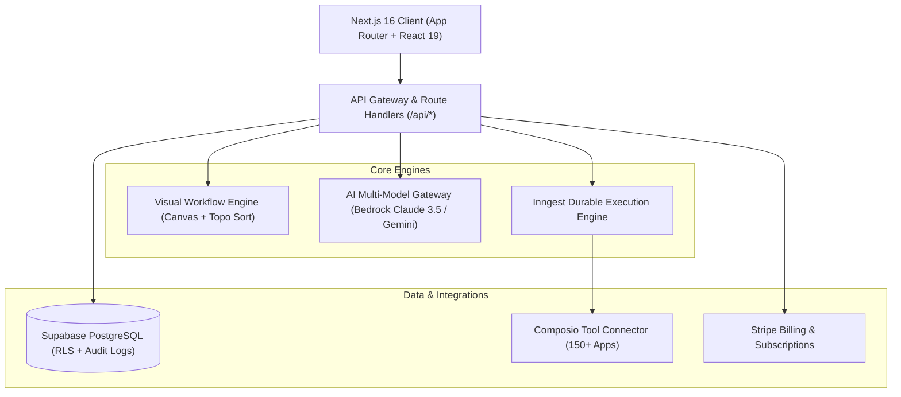
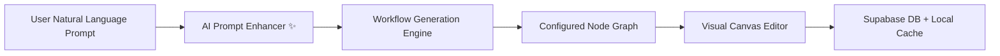
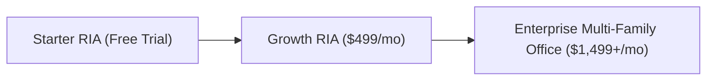

# Product Requirements Document (PRD)
## Adviza AI — Enterprise AI Operating System for Wealth Management & RIAs

---

### Document Metadata
- **Product Name**: Adviza AI
- **Version**: 2.0 (Production Release)
- **Target Audience**: Registered Investment Advisors (RIAs), Multi-Family Offices, Wealth Management Firms, Compliance Officers, and Wealthtech Integrators.
- **Classification**: Enterprise Technical & Product Specification
- **Last Updated**: August 2026

---

## 1. Executive Summary & Vision

### 1.1 Problem Statement
Modern wealth management firms and RIAs manage hundreds of high-net-worth (HNW) client relationships while navigating strict regulatory oversight (SEC Rule 206(4)-1 Marketing Rule, FINRA Rule 2210, fiduciary standard of care). Advisors spend up to **40% of their working hours** on manual, non-revenue-generating operations:
1. **Meeting Preparation**: Sifting through CRM notes, custodian portfolio reports, and email chains before client reviews.
2. **Post-Meeting Follow-up**: Transcribing meeting recordings, drafting summaries, extracting commitments, and logging tasks into CRMs (Salesforce FSC, Wealthbox).
3. **Compliance Overhead**: Ensuring every email, marketing piece, and client recommendation adheres to SEC/FINRA promotional and disclosure standards.
4. **Disjointed Tech Stacks**: Custodians, CRMs, risk engines, billing portals, and communication channels exist in silos with no automated orchestration layer.

### 1.2 Product Vision
**Adviza AI** is the first fiduciary-native, multi-agent AI operating system for wealth management. Adviza AI automates complex advisory workflows from end-to-end—combining visual node-based pipeline orchestration, generative AI agents (Claude 3.5 Sonnet / Gemini), 150+ third-party connectors (via Composio), and human-in-the-loop compliance sign-off gates.

---

## 2. User Personas & Target Roles

| Persona | Role | Primary Goal | Key Pain Point |
| :--- | :--- | :--- | :--- |
| **Lead Advisor / Principal** | Managing Partner / Wealth Advisor | Maximize client-facing time and scale AUM per advisor | High administrative drag; prep and follow-ups take hours |
| **Associate Advisor / Paraplanner** | Operations & Portfolio Support | Execute rebalancing, client onboarding, and briefing notes | Repetitive manual data entry across multiple disconnected platforms |
| **Chief Compliance Officer (CCO)** | Compliance & Regulatory Officer | Maintain audit-proof recordkeeping and prevent regulatory breaches | Risk of unvetted AI outputs or non-compliant client communications |
| **Operations Director / CTO** | Wealthtech / IT Lead | Centralize integrations, monitor pipeline reliability, and manage billing | Fragile custom scripts and fragmented software licenses |

---

## 3. Core Architecture & Tech Stack

### 3.1 Technology Stack Details
- **Frontend Framework**: Next.js 16 (App Router), React 19, TypeScript (Strict Mode).
- **Styling & Design System**: Tailwind CSS, Lucide Icons, Glassmorphism, Warm Obsidian / Fiduciary Slate theme.
- **Database & Auth**: Supabase PostgreSQL with strict Row Level Security (RLS) policies per `firm_id`, Supabase SSR Authentication.
- **LLM Gateway**: Dual-engine routing via AWS Bedrock (Anthropic Claude 3.5 Sonnet v2) and Google Gemini (gemini-2.5-flash / gemini-1.5-pro) with automated heuristic fallbacks.
- **Integration Framework**: Composio SDK connecting Salesforce Financial Services Cloud (FSC), Wealthbox, HubSpot, Google Workspace, Slack, Resend, and LinkedIn.
- **Durable Orchestration**: Inngest for event-driven, fault-tolerant background execution with retries and concurrency control.
- **Monetization**: Stripe Customer Portal, Webhooks, and tiered subscription access.

---

## 4. Key Functional Modules

### 4.1 Executive Dashboard
- **Real-Time KPI Cards**: Total AUM Under Management, Active AI Pipelines, Compliance Health Score, and Executed Automation Runs.
- **Quick Action Bar**: One-click AI workflow generation, client onboarding triggers, and instant compliance audits.
- **Recent Pipeline Activity Feed**: Live execution log showing success/running/failed node steps.

---

### 4.2 Visual Workflow Builder & AI Generator

#### Features & Capabilities:
1. **Interactive Infinite Canvas**:
   - Pan and zoom (40% to 200%) with reset view and auto-fit view algorithms.
   - SVG cubic Bezier curve edge rendering with animated pulse gradients.
   - Mini-map navigator with real-time viewport tracking.
2. **Multi-Selection & Drag-to-Select (Marquee Selection)**:
   - Left-click drag on canvas draws a dynamic marquee box selecting all intersecting nodes in real time.
   - <kbd>Shift</kbd> / <kbd>Cmd</kbd> / <kbd>Ctrl</kbd> + Click for toggle multi-selection.
   - Multi-node drag moves all selected nodes simultaneously, preserving relative spacing.
   - Floating Multi-Selection Action Bar with **Bulk Duplicate** (<kbd>Ctrl</kbd>+<kbd>D</kbd>), **Align Horizontally**, and **Bulk Delete** (<kbd>Delete</kbd> / <kbd>Backspace</kbd>).
3. **AI Prompt-to-Workflow Engine (`/api/ai/workflow-generate`)**:
   - Natural language input bar (e.g., *"When portfolio drifts >5%, run risk audit, require advisor sign-off, and rebalance"*).
   - Generates connected nodes, typed input/output ports, parameters, and layout topology automatically.
4. **AI Prompt Enhancer ("Make Better ✨")**:
   - Takes rough advisory ideas and uses AI to expand them with triggers, compliance audits, human sign-off gates, and Composio connectors.
5. **Unified Dual-Layer Persistence**:
   - Workflows automatically persist to Supabase DB and sync to the local library cache (`adviza_saved_workflows`), ensuring zero data loss across dev and production.

---

### 4.3 Fiduciary AI Agent Fleet

| Agent Name | Category | Primary Function | Inputs / Outputs |
| :--- | :--- | :--- | :--- |
| **Pre-Meeting Briefing Agent** | Advisory Intelligence | Analyzes client portfolio allocation, recent notes, and open tasks before meetings. | **In**: Calendar event, CRM Client ID **Out**: Executive Briefing Memo |
| **Meeting Intelligence Agent** | Meeting Automation | Transcribes audio recordings, extracts commitments, client sentiment, and follow-ups. | **In**: Audio file / Meeting transcript **Out**: Structured tasks & summary |
| **SEC/FINRA Compliance Auditor** | Risk & Compliance | Audits client communications against SEC Rule 206(4)-1 and FINRA Rule 2210. | **In**: Draft email, memo, or social post **Out**: Compliance Score & Flagged Items |
| **Portfolio Drift & Rebalance Agent** | Portfolio Ops | Evaluates asset weight drift against IPS targets and flags tax-loss harvesting. | **In**: Portfolio holdings & target allocation **Out**: Proposed rebalancing orders |
| **Human-in-the-Loop Sign-Off Gate** | Governance | Blocks automated outbound actions until an authorized advisor approves the payload. | **In**: AI payload **Out**: Approved / Rejected signal |

---

### 4.4 Integrations Hub (Composio + Custodians)

- **CRM Platforms**: Salesforce FSC, Wealthbox, HubSpot CRM.
- **Communication & Calendar**: Google Calendar, Gmail, Outlook 365, Resend Email API, Slack Notifications.
- **Social & Content**: LinkedIn Publishing API via Composio.
- **Custodian Connectors**: Prepared architecture for Schwab OpenView, Fidelity Wealthscape, and Pershing NetX360 data feeds.

---

## 5. Security, Fiduciary Compliance & Governance

### 5.1 Fiduciary Safeguards & Non-Negotiables
- **Human-in-the-Loop (HITL) by Default**: Automated financial trades or external client communications cannot execute without explicit advisor approval unless configured otherwise by firm policy.
- **SEC WORM-Compliant Audit Trails**: Every workflow execution, AI decision log, prompt, and output is recorded with immutable timestamps and user IDs in `compliance_audit_logs`.
- **Multi-Tenant Isolation**: Strict PostgreSQL Row Level Security (RLS) guarantees data isolation across distinct wealth management firms (`firm_id`).
- **Zero LLM Training Policy**: Client PII and financial records are processed through enterprise endpoints with contractual zero-data-retention for model training.

---

## 6. Non-Functional Requirements & Performance SLAs

| Metric | Requirement | Target SLA |
| :--- | :--- | :--- |
| **Canvas Frame Rate** | Smooth 60 FPS panning/zooming with up to 100 visual nodes | >= 60 FPS |
| **AI Workflow Generation Time** | Prompt-to-graph complete topology compilation | < 3.5 seconds |
| **AI Prompt Enhancement Time** | Natural language enhancement via LLM / heuristic | < 1.2 seconds |
| **Uptime & Availability** | Core dashboard, workflow runtime, and API gateway | 99.95% |
| **Type Safety & Build Cleanliness** | Strict TypeScript with 0 compiler errors (`tsc --noEmit`) | 100% clean |

---

## 7. Monetization & Subscription Tiers

1. **Starter RIA**:
   - Up to 3 active workflows
   - 50 AI agent executions / month
   - Core Composio integrations (Google Workspace, Resend)
2. **Growth RIA**:
   - Unlimited workflows & canvas pipelines
   - 1,000 AI agent executions / month
   - Full CRM integrations (Salesforce FSC, Wealthbox, HubSpot)
   - SEC/FINRA Compliance Audit Agent
3. **Enterprise Multi-Family Office**:
   - Dedicated AWS Bedrock VPC / Private LLM deployment
   - Unlimited agent executions
   - Custom custodian feed connectors
   - SOC2 Type II compliance audit packet and dedicated SLA

---

## 8. Product Roadmap

### Phase 1: Core Foundation & Canvas Experience *(Completed)*
- [x] Visual node-based workflow builder with pan/zoom, Bezier curves, and mini-map.
- [x] Multi-selection, drag-to-select marquee box, and multi-node drag.
- [x] AI Prompt-to-Workflow generator and AI Prompt Enhancer button.
- [x] Dual-layer persistence with Supabase DB and local caching.

### Phase 2: Autonomous Execution & Custodian Sync *(Current)*
- [ ] Inngest background worker execution for long-running workflows.
- [ ] Real-time Composio OAuth connect modal for Salesforce FSC and Wealthbox.
- [ ] Voice-to-action recording upload directly within client detail views.

### Phase 3: Advanced Intelligence & Enterprise Governance *(Next)*
- [ ] Automated FINRA advertising submission export package (PDF with audit trail).
- [ ] Multi-advisor collaborative canvas with live cursor presence.
- [ ] Custodian automated trade order generation (Schwab / Fidelity FIX protocol).

---

## 9. Node Template Catalog Reference

| Node Type ID | Category | Icon / Color | Description |
| :--- | :--- | :--- | :--- |
| `trigger-calendar` | Trigger | Calendar (Amber) | Triggers on upcoming Google/Outlook calendar events. |
| `trigger-portfolio-drift` | Trigger | TrendingUp (Violet) | Triggers when client asset drift exceeds threshold %. |
| `trigger-audio-upload` | Trigger | Mic (Rose) | Triggers upon client meeting audio recording upload. |
| `trigger-webhook` | Trigger | Webhook (Teal) | Listens for inbound JSON webhooks from external systems. |
| `agent-meeting-briefing` | AI Agent | Brain (Violet) | Compiles executive briefing memo before client meetings. |
| `agent-meeting-intel` | AI Agent | Mic (Indigo) | Transcribes audio and extracts commitments with Claude. |
| `agent-compliance-audit` | AI Agent | ShieldCheck (Emerald) | Audits outputs against SEC Rule 206(4)-1 & FINRA 2210. |
| `agent-rebalance-eval` | AI Agent | TrendingUp (Blue) | Proposes tax-efficient rebalancing trade orders. |
| `logic-human-approval` | Logic Gate | UserCheck (Rose) | Requires advisor sign-off before downstream execution. |
| `logic-condition-branch` | Logic Gate | GitFork (Slate) | Branches workflow execution based on condition rules. |
| `action-salesforce-sync` | Integration | Layers (Blue) | Syncs notes, tasks, and client records to Salesforce FSC. |
| `action-resend-email` | Integration | Mail (Teal) | Dispatches personalized client emails via Resend API. |
| `action-inngest-job` | Integration | Cpu (Purple) | Dispatches background task to Inngest durable queue. |
