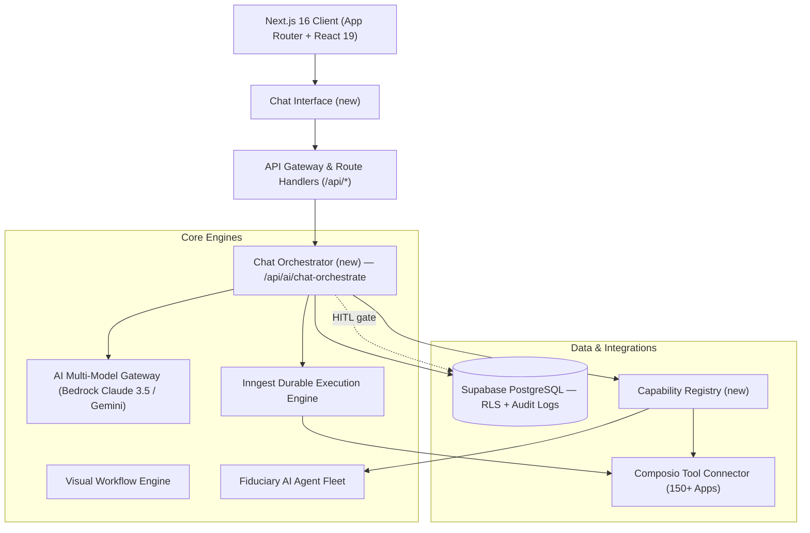

# Adviza AI — Chat & Orchestration Layer
## PRD Addendum (Section 4.5 + Architecture Extension)

---

## 1. Purpose

Add a persistent **Chat** surface to Adviza AI that acts as a natural-language front door to everything the platform already has: the Fiduciary AI Agent Fleet, Composio's 150+ connectors, the Inngest execution engine, and Supabase data. The user should be able to ask for anything in plain English and have the system figure out *which* agent or connector can answer it, fetch/execute accordingly, and — if the required connector isn't authorized yet — prompt for connection inline and auto-resume once connected.

This does not replace the Visual Workflow Builder. Chat is a second, conversational entry point into the same underlying engines (Agent Fleet, Composio, Inngest), with the same compliance guardrails (HITL sign-off, audit logging, RLS) applied identically.

---

## 2. Architecture Extension

**New components:**
- **Chat Interface** — new client surface alongside the Canvas.
- **Chat Orchestrator** (`/api/ai/chat-orchestrate`) — the routing brain; sits parallel to the existing `workflow-generate` endpoint and reuses the same AI Multi-Model Gateway.
- **Capability Registry** — a lookup table mapping "things the system can do" (Composio connector actions + Agent Fleet agents) to callable tool schemas, so the LLM gateway can do tool-calling against it. This is new but should be built from data that already exists (Composio's connector catalog + the Node Template Catalog in Section 9 of the base PRD).

Nothing here replaces Inngest, Composio, RLS, or the audit log — chat is a new caller into the same pipes.

---

## 3. Chat Interface (UX)

- Persistent chat panel (dockable alongside Canvas, or standalone `/chat` route), scoped to the logged-in advisor and their `firm_id`.
- Streaming responses; shows intermediate status ("Checking Salesforce FSC…", "Running Compliance Auditor…") while the Orchestrator works — mirrors the existing Pipeline Activity Feed pattern.
- Structured rendering: briefing memos, task lists, compliance scores, and rebalance proposals render as cards/tables in chat, not raw text — reuse existing dashboard/KPI card components where possible.
- **Connector-missing card**: when a capability needs an unauthorized connector, render a card with the connector name, why it's needed, and a "Connect" button that opens the existing Composio OAuth connect modal (already on the Phase 2 roadmap — chat should trigger the same modal, not a separate flow).
- **HITL card**: any chat-triggered action that would normally require advisor sign-off (per Section 5.1) renders an inline Approve/Reject card — chat never bypasses the sign-off gate.

---

## 4. Chat Orchestrator — Responsibilities

1. **Intent parsing** — via the existing AI Multi-Model Gateway (Claude 3.5 Sonnet primary, Gemini fallback), using tool-calling against the Capability Registry rather than hardcoded intent rules. This keeps the "add a new connector = zero orchestrator code changes" property from the base platform's Composio integration.
2. **Capability resolution** — match the parsed intent to one or more registered capabilities: an Agent Fleet agent (e.g. `agent-meeting-briefing`), a direct Composio connector action (e.g. `salesforce.get_upcoming_events`), or a stored workflow.
3. **Authorization check** — query Supabase for the firm's connector auth status (per-connector, per-`firm_id`, respecting RLS) before calling anything.
4. **Missing-connector flow**:
   - Reply in chat naming the connector and why it's needed.
   - Emit the Composio connect-link/modal trigger inline as a card.
   - On the existing Composio OAuth callback/webhook, fire an event the Orchestrator listens for, then **automatically re-run the original chat request** — no re-prompting the user.
5. **Execution routing**:
   - Fast/synchronous capability (e.g. read-only CRM lookup) → call directly from the API route.
   - Long-running or multi-step capability (e.g. full meeting-briefing agent run, rebalance evaluation) → dispatch as an Inngest durable job, same as workflow node execution, and stream progress back to chat via the job's status.
6. **HITL enforcement** — any action classified as an outbound communication or trade-adjacent action must route through `logic-human-approval` before execution, exactly as in workflow runs. This is non-negotiable per Section 5.1 of the base PRD and applies to chat identically.
7. **Multi-capability fan-out** — for compound asks (e.g. "brief me on my 3pm with the Hendersons and flag if their portfolio drifted"), call multiple capabilities in parallel (calendar + CRM + portfolio-drift agent) and synthesize one reply.
8. **Audit logging** — every chat-triggered capability call, its inputs, outputs, and any HITL decision, is written to `compliance_audit_logs` with the same immutable-timestamp/user-ID scheme as workflow executions. Chat is not exempt from WORM audit requirements.
9. **Error handling** — connector timeout or failure surfaces plainly in chat with a retry option; never fails silently, given the compliance context.

---

## 5. Capability Registry (new component, detail)

A table/service that lists every callable "thing," so the Orchestrator's tool-calling has a closed, typed universe to choose from:

| Field | Description |
|---|---|
| `capability_id` | e.g. `agent-meeting-briefing`, `composio.salesforce.get_events` |
| `source` | `agent_fleet` \| `composio_connector` \| `saved_workflow` |
| `input_schema` / `output_schema` | typed, for the LLM tool-calling contract |
| `requires_hitl` | boolean — pulled from whether the action is outbound/trade-adjacent |
| `required_connector` | which Composio app auth this depends on, if any |

Populate this at build time from: the Node Template Catalog (Section 9 of base PRD) for agents/logic gates, and Composio's connector/action catalog for direct integration calls. This means most of the registry is generated, not hand-written, and stays in sync as Composio connectors or new agents are added.

---

## 6. Example Flow

1. Advisor (in chat): *"How many client meetings do I have today?"*
2. Orchestrator resolves intent → `composio.google_calendar.list_events` (or `outlook.list_events`), timeframe = today.
3. Auth check: Google Calendar not connected for this firm.
4. Chat reply: "Your Google Calendar isn't connected yet." + inline Composio Connect card.
5. Advisor clicks, completes OAuth via the existing Composio modal.
6. Webhook fires → Orchestrator auto-resumes the original request.
7. Chat reply: "You have 4 client meetings today: [list, each with a 'Generate briefing' quick action that calls `agent-meeting-briefing`]."

---

## 7. Non-Functional Requirements (additions to Section 6 table)

| Metric | Requirement | Target SLA |
|---|---|---|
| Chat intent resolution time | Prompt → capability match | < 2 seconds |
| Chat → connector data response (sync capabilities) | Simple read-only fetch | < 3 seconds |
| Connector-reconnect resume | Time from OAuth callback to auto-resumed answer | < 5 seconds |
| Chat audit log write | Every capability call logged before response returned to user | 100% coverage |

---

## 8. Roadmap Placement

Fits naturally into **Phase 2 (Autonomous Execution & Custodian Sync)**, alongside the already-planned "Real-time Composio OAuth connect modal" — the chat orchestrator is effectively the conversational trigger for the same connect flow already on the roadmap, plus a new Capability Registry and chat surface.

Suggested additions to Phase 2 checklist:
- [ ] Chat interface (new client surface)
- [ ] Capability Registry (Agent Fleet + Composio actions, auto-generated)
- [ ] Chat Orchestrator API route with tool-calling against the Registry
- [ ] Missing-connector card wired to existing Composio connect modal + auto-resume on connect
- [ ] Chat-triggered actions routed through existing HITL sign-off gate and `compliance_audit_logs`

---

## Open Decisions
- Does chat get its own conversation/session table, or reuse the Pipeline Activity Feed's execution log for history?
- Should compound multi-capability asks always fan out in parallel, or should some (e.g. anything trade-adjacent) force sequential HITL checkpoints between steps?
- Do saved Workflows become directly invocable from chat by name (e.g. "run my Monday rebalance check workflow"), in addition to raw agent/connector capabilities?
