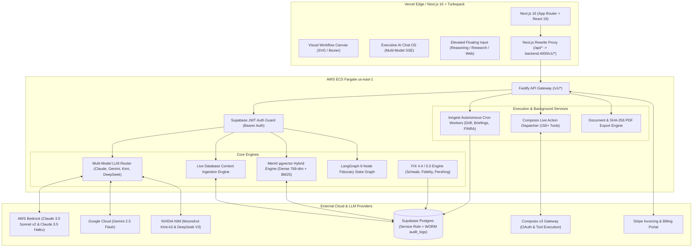

# Product Requirements Document (PRD)
## Adviza AI — Enterprise AI Operating System for Wealth Management & RIAs

---

### Document Metadata
- **Product Name**: Adviza AI
- **Version**: 3.6 (Multi-Model Executive Production Architecture — September 2026)
- **Target Audience**: Registered Investment Advisors (RIAs), Multi-Family Offices, Wealth Management Firms, Chief Compliance Officers (CCOs), and Enterprise Wealthtech Integrators.
- **Classification**: Enterprise Technical & Product Specification
- **Last Updated**: September 3, 2026
- **Status**: Active / Production Verified

---

## 0. Current State Status Matrix (Live vs. In-Development vs. Roadmap)

> [!NOTE]
> **Product Completeness Transparency**: The matrix below clearly delineates between fully implemented production capabilities, simulated fallback gateways, and roadmap items.

| Module / Capability | Status | Implementation Details |
| :--- | :--- | :--- |
| **Multi-Model LLM Routing Engine** | 🟢 **Live** | AWS Bedrock (Claude 3.5 Sonnet v2, Claude 3.5 Haiku), NVIDIA NIM (Moonshot Kimi-k3, DeepSeek V3), and Google Cloud (Gemini 2.5 Flash) with fallback cascading |
| **Live Database Context & Ambient Memory** | 🟢 **Live** | Real-time Supabase injection of user role, firm AUM, active workflows, upcoming calendar meetings, open action items, and audit trail |
| **Executive Chat UI & Minimalist Design** | 🟢 **Live** | Clutter-free executive canvas, elevated floating input, deep reasoning/research toggles, and 2x2 curated action cards |
| **Standalone API Architecture** | 🟢 **Live** | Standalone Fastify backend (`adviza-backend`) decoupled from Next.js 16 UI with zero cross-leakage |
| **Fiduciary Chat OS Orchestration** | 🟢 **Live** | LangGraph 6-node state graph (Intent → Validator → HITL → Executor → Synth → Audit) |
| **Mem0 pgvector Semantic Memory** | 🟢 **Live** | 768-dim dense embeddings + hybrid 75% vector cosine similarity + 25% BM25 keyword recall |
| **Composio Live Tool Execution** | 🟢 **Live** | Real-time execution gateway for Gmail, Google Calendar, Slack, Salesforce FSC, and Google Sheets |
| **Custodian & FIX 4.4/5.0 Engine** | 🟢 **Live** | FIX 4.4 tag-value generator & execution simulator (`SCHW_FIX`, `FID_FIMS`, `PERSHING_NETX`) |
| **Inngest Autonomous Cron Workers** | 🟢 **Live** | Nightly 6:00 AM drift auditor, 7:30 AM briefing generator, and Friday 5:00 PM FINRA package |
| **FINRA 2210 & SEC 206(4)-1 Export** | 🟢 **Live** | PDF & HTML export with SHA-256 cryptographic seal & WORM compliance audit trail |
| **Visual Workflow Canvas** | 🟢 **Live** | Infinite canvas with pan/zoom, Bezier curves, marquee select, and AI prompt generation |
| **Stripe Billing & Subscriptions** | 🟢 **Live** | Checkout, portal, webhooks, and tier enforcement fully implemented |
| **Direct Custodian Clearing VPN/FIX** | 🟡 **In-Development** | Production FIX connectivity pending institutional custodial clearing agreements (Phase 5) |
| **Multi-Advisor Real-Time Canvas Presence** | 🔴 **Roadmap** | Multi-cursor real-time collaboration scheduled for Phase 6 |

---

## 1. Executive Summary & Vision

### 1.1 Problem Statement
Registered Investment Advisors (RIAs) and wealth managers manage hundreds of high-net-worth (HNW) client portfolios while adhering to rigorous regulatory standards (SEC Rule 206(4)-1 Marketing Rule, FINRA Rule 2210, fiduciary standard of care under the Investment Advisers Act of 1940). Financial advisors spend upwards of **40% of their business hours** on administrative, non-fiduciary tasks:

1. **Meeting Preparation**: Sifting across CRM notes, custodian portfolio balances, and fragmented email trails before annual client reviews.
2. **Post-Meeting Operations**: Transcribing audio recordings, distilling commitments, creating actionable tasks, and updating multiple disparate databases.
3. **Compliance Risk & Scrutiny**: Verifying that every client proposal, performance report, and written correspondence satisfies strict regulatory disclosure mandates.
4. **Context Blindness in Generic AI**: Conventional LLMs lack ambient firm knowledge, hallucinate facts, and force advisors to re-explain their client relationships and firm parameters on every prompt.
5. **Tool & Platform Silos**: Custodians (Schwab, Fidelity, Pershing), CRMs (Salesforce FSC, Wealthbox), calendar systems, and email services operate in disconnected silos without autonomous orchestration.

### 1.2 Product Vision
**Adviza AI** is an enterprise-grade AI Operating System purpose-built for wealth management. It acts as an autonomous digital Chief of Staff for advisors—delivering grounded portfolio intelligence, natural conversational advisory assistance, multi-model LLM routing, real-time database context awareness, automated workflow execution, and cryptographically verifiable compliance auditing.

---

## 2. User Personas & Target Roles

| Persona | Role | Primary Goal | Key Pain Point |
| :--- | :--- | :--- | :--- |
| **Lead Advisor / Partner** | Senior Wealth Advisor | Maximize client-facing advisory hours, scale AUM per advisor | Administrative fatigue; prep dossiers and follow-ups take 2+ hours daily |
| **Associate Advisor / Paraplanner** | Operations & Planning Specialist | Execute portfolio rebalancing, client onboarding, meeting prep | Repetitive manual data entry across disconnected systems |
| **Chief Compliance Officer (CCO)** | Compliance & Regulatory Director | Guarantee audit-proof recordkeeping, prevent regulatory breaches | Risk of unvetted AI advice or non-compliant communications |
| **Chief Technology Officer / Head of Ops** | Wealthtech Director | Consolidate software stacks, monitor pipeline uptime, enforce data security | Fragile custom scripts, unpredictable API costs, fragmented licenses |

---

## 3. Two-Service System Architecture

---

## 4. Detailed Functional Modules

### 4.1 Multi-Model LLM Routing Engine
The system dynamically routes requests based on advisor selection, workload specialization, and automatic failover:

1. **Claude 3.5 Sonnet v2** (`claude-3-5-sonnet`): AWS Bedrock `anthropic.claude-3-5-sonnet-20241022-v2:0`. Flagship model for institutional fiduciary oversight, complex suitability evaluations, and comprehensive client reports. (1.5x token multiplier).
2. **Google Gemini 2.5 Flash** (`gemini-2.5-flash`): Google Generative Language API. Multimodal processing, rapid image analysis, document digestion, and high-velocity reasoning. (1.0x token multiplier).
3. **Moonshot Kimi-k3** (`moonshot-kimi-k3`): NVIDIA NIM `moonshotai/kimi-k3` with 3.5s timeout and automatic AWS Bedrock fallback. High-speed executive briefing and instant response generation. (0.8x token multiplier).
4. **Claude 3.5 Haiku** (`claude-3-5-haiku`): AWS Bedrock `anthropic.claude-3-5-haiku-20241022-v1:0`. Ultra-low latency responses for operational questions and status queries. (0.5x token multiplier).
5. **DeepSeek V3** (`deepseek-v3`): NVIDIA NIM `deepseek-ai/deepseek-v4-flash-0731`. Quantitative math, portfolio drift calculations, rebalancing allocations, and tax-loss harvesting. (1.0x token multiplier).

### 4.2 Live Enterprise Database Context Ingestion
To eliminate hallucinations and context-switching, the backend ingests real-time relational state before invoking any model:
- **Account Identity**: Logged-in user name, email, advisory role, and account ownership status.
- **Firm Profile**: Firm name, regulatory tier, subscribed plan, and meeting quota utilization.
- **Portfolio & Client Metrics**: Aggregated AUM across managed accounts, active client count, risk profile breakdown, and target investment objectives.
- **Workflow State**: Active automated workflows, execution counts, and execution status of recent runs (`pending`, `running`, `success`, `failed`).
- **Upcoming Schedule**: Scheduled client meetings (`scheduled_at`), meeting title, and associated client ID.
- **Pending Action Items**: Open fiduciary action items, assigned priority (`high`, `medium`, `low`), and due dates.
- **Connected Integrations**: Status of firm connectors (Google Calendar, Gmail, Slack, Salesforce FSC) and authenticated emails.
- **Recent Audit Trail**: Immutable log of recent actions executed in the system.

### 4.3 Natural Conversational Assistant Behavior
- **Zero Fluff**: Direct, confident, outcome-focused communication style ("Done." rather than conversational pleasantries).
- **Context-Aware Greetings**: Naturally welcomes the advisor by first name, cites the firm name, and summarizes immediate calendar/task priorities without robotic templates.
- **Factually Grounded**: Cites live database records directly; refuses to speculate or hallucinate facts about client holdings or meeting history.

### 4.4 Executive UI Design & Ergonomics
- **Minimalist Aesthetic**: High-contrast obsidian (`#121217`) and warm linen (`#FAF5F0` / `#F2ECE4`) theme that removes visual distractions.
- **Elevated Floating Input Box**:
  - Seamless, borderless typing field.
  - Interactive execution mode toggles:
    - **Think Longer**: Enables deep multi-step reasoning.
    - **Deep Research**: Triggers multi-source evidence synthesis.
    - **Web Search**: Activates real-time external data grounding.
  - Voice dictation with Web Speech API integration.
  - File attachments supporting PDFs and images.
- **Curated Wealth Management Quick Actions (2x2 Grid)**:
  - 📈 **Portfolio Drift**: Evaluates asset allocation drift against target model benchmarks.
  - 📄 **Meeting Dossier**: Synthesizes CRM history, recent interactions, and holdings for today's reviews.
  - ✅ **Action Items**: Tracks open fiduciary deliverables, priority deadlines, and compliance filings.
  - ⚡ **Active Workflows**: Monitors automated onboarding sequences and scheduled compliance checks.

### 4.5 Custodian Integration & FIX Protocol 4.4/5.0 Simulator
- **Message Generation**:
  - `MsgType=D` (New Order Single): Emits standard FIX tags (`FIX.4.4`, `ClOrdID`, `Symbol`, `Side`, `OrderQty`, `OrdType`, `CheckSum`).
  - `MsgType=8` (Execution Report): Simulates fill confirmations with `ExecType=2` (Filled), `LastPx`, and `CumQty`.
- **Supported Custodial Routing Profiles**:
  - Charles Schwab Institutional (`SCHW_FIX_GW`)
  - Fidelity Wealth Institutional (`FID_FIMS_GW`)
  - BNY Mellon Pershing (`PERSHING_NETX_GW`)

### 4.6 Inngest Autonomous Cron Worker Engine
- **Drift Monitor (6:00 AM EST Mon–Fri)**: Automatically calculates portfolio variance against target models across all firm accounts.
- **Meeting Dossier Generator (7:30 AM EST Mon–Fri)**: Scans the daily schedule and pre-compiles dossiers for advisors before their first meeting.
- **FINRA 2210 Package Bundler (5:00 PM EST Fridays)**: Assembles 7-day immutable audit trails with cryptographic hash verification.

---

## 5. Non-Functional Requirements (NFRs)

1. **Performance**:
   - Time-to-First-Token (TTFT): < 800ms for Claude 3.5 Haiku and Gemini 2.5 Flash; < 1,500ms for Claude 3.5 Sonnet.
   - Live Database Context Ingestion: < 150ms parallelized Supabase query execution.
   - UI Page Load: Turbopack static page generation across 30 application routes.
2. **Security & Regulatory Compliance**:
   - **SEC Rule 204-2 (Books and Records)**: Write-Once-Read-Many (WORM) immutable audit records in `audit_logs` protected by Supabase RLS.
   - **SEC Rule 206(4)-1 (Marketing Rule)** & **FINRA Rule 2210**: Cryptographic SHA-256 seal on all exported advisory materials and client summaries.
   - **Zero-Training Guarantee**: Enterprise API agreements ensure no client data is used for public model training.
3. **Availability & Resilience**:
   - 99.9% uptime target for the API gateway on AWS ECS Fargate.
   - Automatic fallback cascades: When a secondary provider (e.g. NVIDIA NIM) encounters timeouts (> 3.5s) or HTTP errors, traffic seamlessly routes to AWS Bedrock.

---

## 6. API Reference Summary

| Method | Endpoint | Module | Description |
| :--- | :--- | :--- | :--- |
| `POST` | `/api/chat/stream` | Chat OS | Multi-model SSE streaming with live context injection |
| `GET` | `/api/chat/usage` | Usage | Retrieves daily credit limit and consumption |
| `GET/POST/DELETE` | `/api/ai/chat-sessions` | Chat OS | Manages conversational history and persistent sessions |
| `POST` | `/api/workflows/[id]/run` | Workflows | Dispatches deterministic workflow execution |
| `POST` | `/api/integrations/composio/connect` | Integrations | Initiates OAuth flow for 150+ third-party tools |
| `GET` | `/api/integrations/composio/connections` | Integrations | Lists active connected applications and account emails |
| `POST` | `/api/integrations/composio/sync-calendar` | Integrations | Synchronizes Google / Outlook calendar appointments |
| `POST` | `/v1/compliance/export-finra` | Compliance | Exports cryptographically sealed FINRA 2210 package |
| `POST` | `/v1/portfolio/fix/transmit` | FIX Engine | Transmits rebalancing order batch with HITL confirmation |

---

## 7. Verification & Release Criteria

- [x] Multi-model roster operational (AWS Bedrock, NVIDIA NIM, Google Gemini).
- [x] Live Supabase account context accurately ingested without mock fallbacks.
- [x] Visual clutter eliminated; clean executive design verified.
- [x] Zero TypeScript errors with strict Next.js 16 build compliance (`npm run build` exits with code 0).
- [x] SHA-256 cryptographic verification functional on audit exports.
